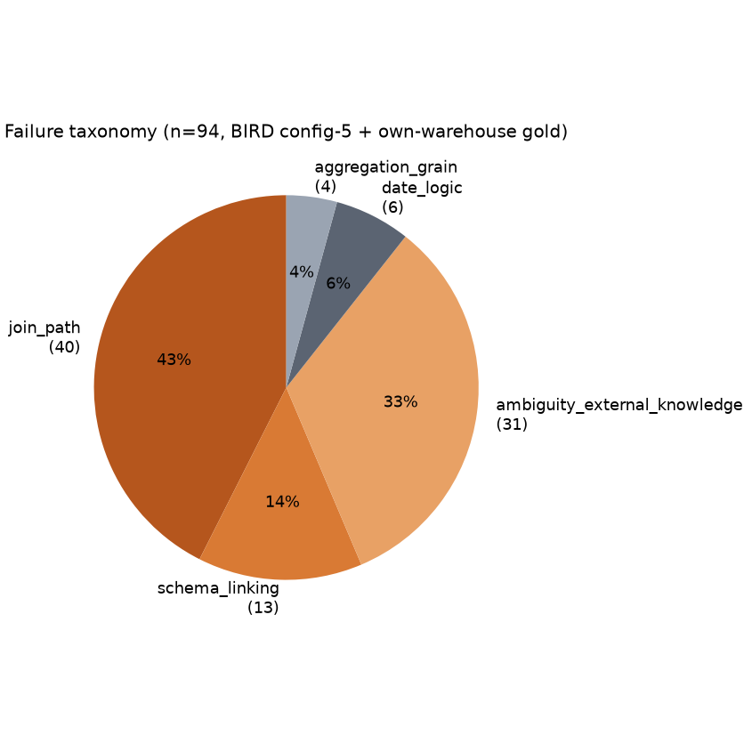

# Failure taxonomy notes

97 failures pooled from BIRD mini-dev config `5_plus_repair_loop` (58 of its 58 failures) and the
own-warehouse gold eval (39 of its 39 failures), classified by a rule-based classifier
(`eval/failure_taxonomy.py`) over the predicted SQL, gold SQL, and the actual DB error text
(recovered by re-executing each failing predicted query, since the summary JSON only stored a
pass/fail bit -- see `scripts/build_failure_taxonomy.py`).

**Caveat, stated plainly**: this is a first-pass rule-based classifier, spot-checked by hand
against samples from each bucket, not a ground-truth human label on every row. One real bug was
caught and fixed during that spot-check (below) -- treat the percentages as indicative, not exact.

| Category | Count | % |
|---|---|---|
| join_path | 37 | 38.1% |
| ambiguity_external_knowledge | 31 | 32.0% |
| schema_linking | 19 | 19.6% |
| date_logic | 6 | 6.2% |
| aggregation_grain | 4 | 4.1% |

## A bug the spot-check caught

The initial run classified 46.4% of failures as `join_path`. Reading actual examples showed many
were misclassified: the join-table regex captured `main` instead of `comments` from
`JOIN main.comments` (it stopped at the first `.`), so any predicted query that happened to
schema-qualify its tables looked like it joined a different table than gold, even when the join
was identical. Fixing the regex to take the last dot-separated segment dropped `join_path` from
46.4% to 38.1% and moved those rows into `ambiguity_external_knowledge` (a missing `DISTINCT`
after a 1:many join, correctly recognized as row-duplication) and `aggregation_grain`. This is
exactly the kind of thing "categorize 100 failures" is supposed to surface -- the taxonomy tool
itself had a bug that would have shipped an overstated join-path story.

## The two fixes already shipped for the two biggest slices

**join_path (38.1%)** -- real examples included using `player_api_id` instead of the correct
`player_fifa_api_id` to join `Player`/`Player_Attributes` (BIRD's `european_football_2` db has two
parallel ID systems, a known hard case), and a CTE that silently dropped a required join to
`yearmonth` entirely. Two shipped mitigations:
1. **Schema retrieval + value index** (ablation configs 2-3) took BIRD exec accuracy from
   32%→38% before self-critique/repair were even added -- surfacing the right column names and
   sample values measurably cuts wrong-column/wrong-join guesses.
2. **The repair loop** (config 5, 36%→42%) turns a DB binder error like `no such column:
   p.WBC` into a second attempt with that exact error text -- effective specifically when the
   first guess named a plausible-but-wrong column, which is exactly what a join-path slip looks
   like from the database's side.

Open gap: BIRD's raw SQLite schemas ship with zero column documentation (see
`eval/bird_catalog.py`), so there's no equivalent of our own warehouse's
`FK to dim_customers.customer_id`-style descriptions to retrieve -- schema retrieval on BIRD can
only work from column names and sample values, not relationship intent. This is a large part of
why own-warehouse join-path failures are proportionally rarer than BIRD's.

**ambiguity_external_knowledge (32.0%)** -- real examples included a missing `DISTINCT` after a
1:many join (row duplication, not wrong logic) and a literal-encoding case where "infinite power"
is stored as `'*'` in the `cards` table, not `'∞'` -- something no amount of schema reading tells
you. Shipped mitigation: BIRD's `evidence` field (the benchmark's own external-knowledge hint) is
concatenated directly into the question text before generation
(`eval/bird_pipeline.run_bird_question`) rather than discarded, and our own warehouse's value
index (`retrieval/value_index.py`) resolves literal mismatches the same way for cases where the
encoding is a *stored value* rather than a documented convention. Genuine open gap: a symbolic
encoding like `'*'` for infinity isn't a value the value index would ever surface as a match for
the word "infinite" (no textual or semantic similarity) -- that class of external knowledge would
need a per-database glossary, which doesn't come for free and is exactly the kind of limitation
worth stating rather than papering over.
